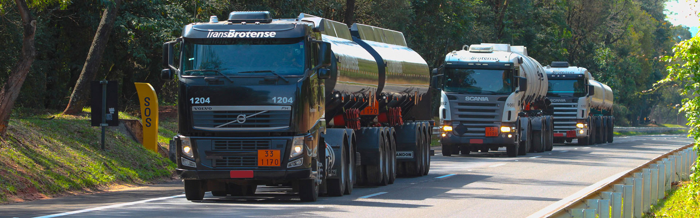

    <h1>TransBrotense</h1>

Fundada em 1973, a TransBrotense se orgulha de ser uma referência no transporte rodoviário de cargas.
Com mais de 50 anos de experiência, nossa missão é garantir a máxima eficiência e segurança na movimentação de granéis sólidos, 
líquidos inflamáveis e contêineres. Localizada em Brotas, SP, nossa infraestrutura moderna e equipe qualificada nos permitem oferecer serviços de alta qualidade para atender às necessidades de nossos clientes.
Estamos sempre prontos para entregar excelência em transporte e logística.

## Entre em contato

- [Site](https://transbrotense.com.br)
- [Telefone](tel:+551436539333)
- [Email](mailto:contato@transbrotense.com.br)
